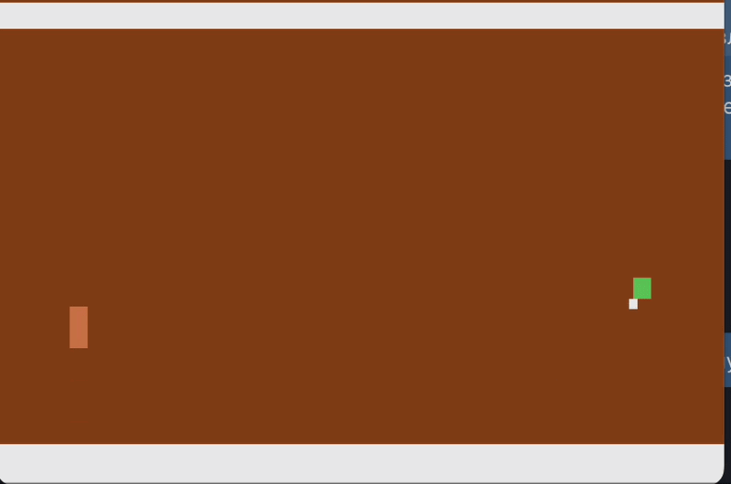
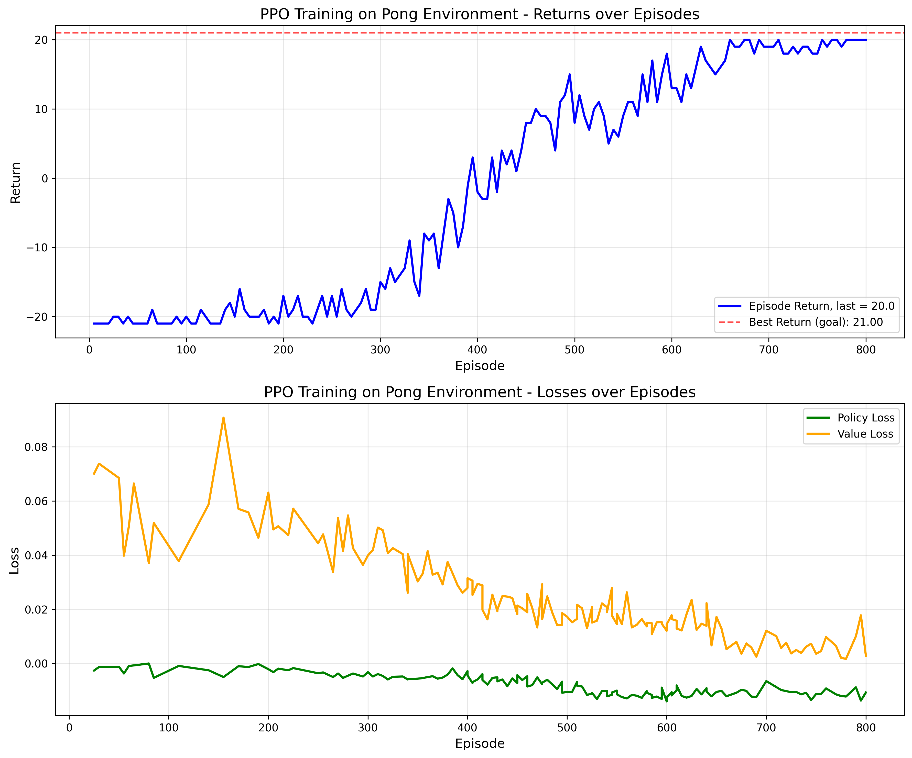

# PPO vs REINFORCE on Atari Pong

Reinforcement learning project comparing **REINFORCE** (vanilla policy gradient) and **PPO** (Proximal Policy Optimization) on the classic Atari game **Pong**, with **Pygame** visualization.

The agent is trained **from pixels** using a Convolutional Neural Network (CNN).  
It does not receive ball coordinates or paddle positions. It only observes stacked grayscale images of the game board and must learn visual representations internally.

---

# Problem Formulation

We model Atari Pong as a **Markov Decision Process (MDP)**:

$$
v^{\pi^\theta}(s):=\mathbb{E}\left[\sum_{t=0}^{T-1}\gamma^tR_t\mid S_0=s\right]\rightarrow\max_{\pi},\quad s\in\mathcal{S}
$$

subject to:

$$
s_{t+1}\sim p(\cdot\mid s_t,a_t),\quad
a_t\sim\pi_\theta(\cdot\mid s_t),\quad
r_t\sim p^R(\cdot\mid s_t,a_t)
$$

Where:

- $s_t$ — stacked image observation  
- $a_t$ — discrete action  
- $r_t$ — reward  
- $\gamma\in[0,1]$ — discount factor  
- $\pi_\theta(a|s)$ — policy parameterized by neural network  

The objective is to learn a policy $\pi_\theta$ maximizing expected return.

---

# Environment

## Game Setting




- **Game**: Atari Pong — the agent controls **one paddle**; the **other paddle is the built-in game AI** (the “computer”). The agent always plays against the same opponent.
- **Episode**: Runs until one player scores **21 points**.
- **Frame skip**: 4 (each action repeats for 4 frames).

During training, **the agent plays against the Atari game’s built-in AI**.  
There is no human in the loop.

---

## State

Each state $s\in\mathcal{S}$ is:

$$
s_{4\times84\times84}
$$

where:

- Stack of the last **4 grayscale frames**
- Each frame resized to $84\times84$
- Pixel values normalized to $[0,1]$

The agent never sees the full-color game screen.

### Why grayscale (and why no ball coordinates)?

- **Grayscale**: The agent is trained “from pixels” on purpose. Using grayscale keeps the input small and matches the usual Atari RL setup. Color does not add useful information in Pong.
- **No ball coordinates**: We do **not** provide $(x,y)$ of the ball. This is a pure pixel-based RL problem. The CNN must learn to detect paddles and ball directly from images.

---

## Actions

$$
\mathcal{A}=\{0,1,2,3,4,5\}
$$

Six discrete Atari actions (NOOP, FIRE, RIGHT, LEFT, etc.).

---

## Rewards

Sparse and delayed reward:

$$
r=
\begin{cases}
+1 & \text{if agent scores a point}\\
-1 & \text{if opponent scores}\\
0 & \text{otherwise}
\end{cases}
$$

Return per episode:

$$
G=\sum_{t=0}^{T-1}R_t
$$

In Pong:

$$
\text{return}=\text{agent points}-\text{opponent points}
$$

Hundreds of steps may pass with zero reward, making credit assignment difficult.

---

## Transition Function

The transition dynamics are governed by the Atari emulator:

$$
s_{t+1}=f_{\text{ALE}}(s_t,a_t,\xi_t)
$$

where:

- $f_{\text{ALE}}$ — Pong game engine  
- $\xi_t$ — internal emulator randomness  

The agent can move up or down, or stay at each timestep. The ball is moving with constant velocity, reflecting from the walls and paddles orthogonally.

---

# Policy Model (CNN from Pixels)

We approximate $\pi_\theta(a|s)$ using a Convolutional Neural Network:

$$
\pi_\theta(a|s)=\text{Softmax}(f_\theta(s))
$$

Architecture:

- Conv layer: 32 filters  
- Conv layer: 64 filters  
- Conv layer: 64 filters  
- Fully connected layer: 512 units  
- Linear output layer: logits over 6 actions  

The CNN learns visual features detecting paddles, ball, and motion patterns directly from images.

---

# REINFORCE (Vanilla Policy Gradient)

We use Monte-Carlo policy gradient without baseline.

## Objective

$$
\nabla_\theta J(\theta)=\mathbb{E}_\pi\left[G_t\nabla_\theta\log\pi_\theta(A_t\mid S_t)\right]
$$

Where:

$$
G_t=\sum_{k=t}^{T-1}\gamma^{k-t}R_k
$$

---

## Loss

$$
\mathcal{L}=-G_t\log\pi_\theta(A_t\mid S_t)
$$

Properties:

- One update per episode  
- High variance  
- Poor credit assignment for long delayed rewards  

REINFORCE often struggles to learn Pong reliably due to sparse rewards and long trajectories.

---

# PPO (Proximal Policy Optimization)

PPO improves stability and sample efficiency.

---

## Importance Sampling Ratio

Let $\pi_{\theta_{\text{old}}}$ be the previous policy:

$$
r_t(\theta)=\frac{\pi_\theta(A_t\mid S_t)}{\pi_{\theta_{\text{old}}}(A_t\mid S_t)}
$$

---

## Advantage Estimation (GAE)

Temporal difference:

$$
\delta_t=R_t+\gamma V(S_{t+1})-V(S_t)
$$

Generalized Advantage Estimation:

$$
A_t=\sum_{l=0}^{\infty}(\gamma\lambda)^l\delta_{t+l}
$$

---

## Clipped Surrogate Objective

$$
\mathcal{L}^{\text{CLIP}}=\mathbb{E}\left[\min\left(r_t(\theta)A_t,\text{clip}(r_t(\theta),1-\epsilon,1+\epsilon)A_t\right)\right]
$$

---

## Final PPO Loss

$$
\mathcal{L}=-\mathcal{L}^{\text{CLIP}}
$$

Optimization details:

- Rollout length: 2048 steps  
- 4 epochs per rollout  
- Minibatch size: 64  
- Adam optimizer  

PPO is more stable and sample-efficient than REINFORCE in pixel-based environments.

---

# Why PPO over REINFORCE?

- **REINFORCE** uses full-episode returns; it suffers from high variance and poor credit assignment with long delayed reward.
- **PPO** uses:
  - Clipped surrogate objective for stable updates
  - Generalized Advantage Estimation (GAE)
  - Multiple epochs over minibatches

Together, this makes PPO more stable and capable of learning Pong where naive REINFORCE often fails.

---

# Training Visualization

When running with `--visualize`, the Pygame window shows:

- **Left panel**: The agent’s 84×84 grayscale input (scaled up). This is what the CNN sees.
- **Right panel**: Score, episode/step, return over recent episodes, and policy loss.

The real Atari game is not rendered during training.

**Display fix:** Observations are scaled from $[0,1]$ to $[0,255]$ for visualization so the grayscale image is visible.

---

## Results

We are evaluating PPO performance only, since REINFORCE takes extremely long time to learn at least something, in case of such sparse reward and complex input.

| Policy | Expected reward |
|--------|--------------------|
| REINFORCE | $\approx$ -20 |
| **PPO** | $\approx$ **+20** |

The PPO successfully learned almost optimal policy (expected reward 20 vs maximum reward 21) for such complex case as CNN-based input and pretty long game with rare rewards. 

**PPO learning curve**:



---
# Extras
---

# Why is average return still about -20 after 80k steps?

- Return = agent points − opponent points (to 21).  
- −20 means the agent is losing almost every rally, which is normal early in training.
- Pong from pixels is hard due to sparse rewards.
- 80k steps is still early. Many setups require 1–2 million steps before performance becomes positive.

If learning stagnates:

- Lower learning rate (e.g. `--lr 1e-4`)
- Train longer (e.g. `--timesteps 2000000`)
- Verify that the agent’s grayscale view is displayed correctly.

---

# Setup

```bash
cd "your_path/atari"
pip install -r requirements.txt
```

**Note**: `ale-py` includes Atari ROMs.

---

# Project Structure

| File | Description |
|------|-------------|
| `env_utils.py` | Builds Pong env with 84×84 grayscale and 4-frame stack. |
| `models.py` | CNN feature extractor and actor-critic heads (PyTorch). |
| `agents.py` | REINFORCE and PPO agents. |
| `visualize.py` | Pygame window: game view, score, episode returns, loss curves. |
| `train.py` | Training script. |
| `run_eval.py` | Evaluate checkpoint with Pygame stats. |
| `play_pong.py` | Watch the trained agent in the real Atari Pong game. |

---

# Usage

### Train with live visualization

```bash
python train.py --algorithm ppo --visualize --timesteps 500000
```

```bash
python train.py --algorithm reinforce --visualize --episodes 500
```

### Train without display

```bash
python train.py --algorithm ppo --timesteps 500000 --no-viz
```

### Evaluate saved model

```bash
python run_eval.py --checkpoint ppo_pong.pt --algorithm ppo --episodes 5
```

### Watch trained agent in real Pong

```bash
python play_pong.py --checkpoint ppo_pong.pt --algorithm ppo --episodes 3
```

Checkpoints are saved as `ppo_pong.pt` and `reinforce_pong.pt`.

---

# Implementation Details

- **CNN**: 3 conv layers (32, 64, 64 filters) + MLP (512).
- **REINFORCE**: One update per episode.
- **PPO**: GAE ($\lambda=0.95$), clip $\epsilon=0.1$, 4 epochs per rollout.
- **Optimizer**: Adam.

---

# License

MIT